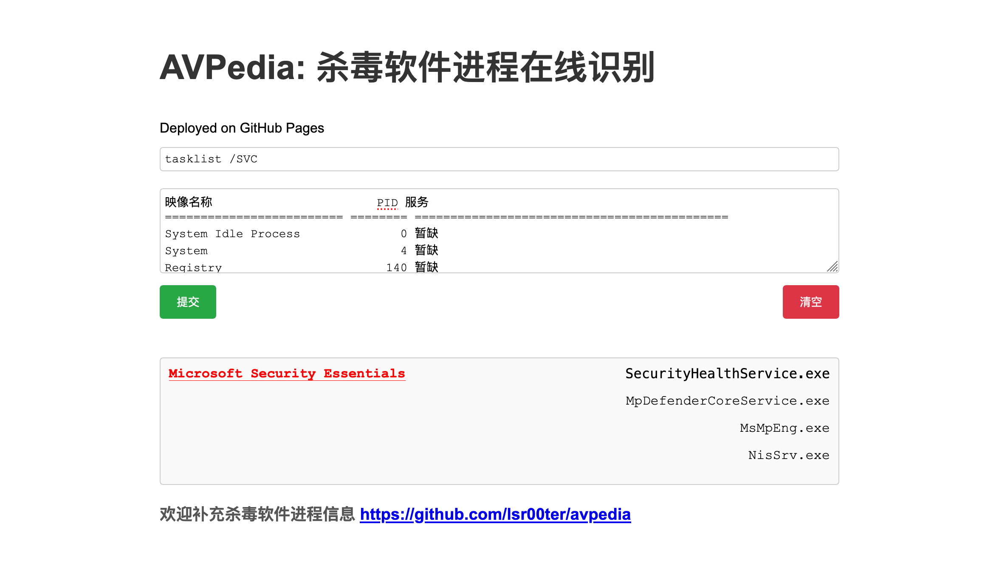

# AVPedia

## ✈️ 工具概述

杀软识别一直是内网渗透中常见的课题，网络上也有非常多的在线杀软识别的网站

但很多在线识别的网站，都已经年久失修，许多新的杀软进程无法有效准确识别

本项目就是做一款长期维护的在线杀软识别网站，帮助各位师傅在内网渗透中更进一步~

## 📝 TODO
* [x] 感谢 @msmoshang 师傅提交的 PR，对杀软识别结果的去重处理
* [x] 感谢 @Mr-xn 师傅提交的 PR，新增对于 `Norton` 以及 `Kaspersky` 的识别补充
* [x] 针对于提交的文本挤在一起无法识别的情况，进行了专门的优化匹配
* [x] 新增对于 `Fortinet` 飞塔进程的识别补充
* [x] 新增对于 `TQClient` 360 天擎进程的识别，感谢 @DmTomHL 师傅提供的资料
* [x] 相同杀毒软件进程归并
* [x] 感谢 @msmoshang 师傅对杀软库的去重和归档
* [x] 从行开头进行进程匹配，避免进程识别结果误报
* [x] 新增对于 `OneSEC` 微步终端在线安全进程的识别，感谢 @SunshineBread 师傅提供的资料
* [x] 新增对于 `SentinelOne` 哨兵一号进程的识别，感谢 @wulala 师傅提供的资料
* [x] 感谢 @土豆 师傅提供的资料，更新了一些杀软库
* [x] 采用 Json 匹配的方式，放弃数据库查询从而避免 SQL 注入，更加轻量化

## 🚨 项目优势

* 页面简洁明了，没有多余的资源消耗
* 代码轻量化部署，安全可靠
* Json 格式容易维护，感谢项目 [StudyCat404/WhatAV](https://github.com/StudyCat404/WhatAV) 提供的支持
* 我们将持续维护本仓库，欢迎给我们提交 PR~

## 🙏 感谢各位师傅

